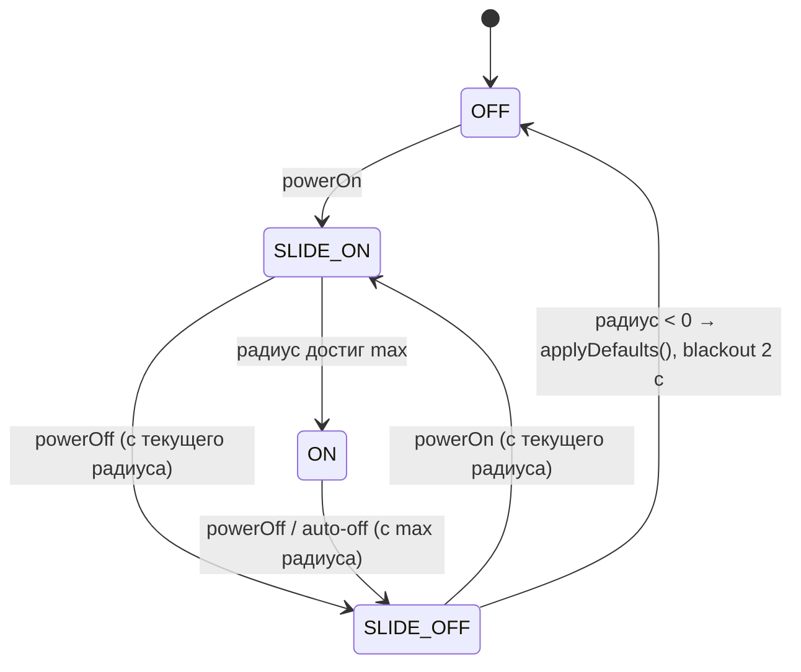

# ARCHITECTURE — Smart Mirror RGBW, прошивка v1.1.1

> Статус: **реализован и проверен на железе.** Ветка `refactor/v1` слита в `main` 21.09.2026; 22.09.2026 прошивка
> v1.0.0 собрана, прошита в зеркало и работает так же, как v27.
>
> v1.0.1 (22.09.2026): анимация включения/выключения на ~20% медленнее и с мягким краем на ~20% длиннее (§4.1).
>
> v1.1.0 (22.09.2026): глитч «сбой неона» — короткое мерцание 3–6 светодиодов примерно раз в минуту (§4.6).
>
> v1.1.1 (22.09.2026): у глитча мягкие края — по 2–3 светодиода плавного перехода к обычному свету (§4.6).
>
> v1.0.0 — порт прошивки v27 (Gemini-эпоха) с монолитного `main.cpp` на модульную архитектуру.
> Нумерация версий начинается заново с 1. Визуальное поведение (скорости, размеры, цвета) сохраняется,
> все намеренные изменения поведения перечислены в разделе 11.

---

## 1. Цели

1. **Потокобезопасность by design.** Ядро 0 физически не имеет доступа к ленте и к состоянию зеркала.
2. **Новый эффект = 3 декларативные правки** (класс, строка реестра, строка в `effect_list` HA).
3. **Логика тестируется на ПК** (`pio test -e native`) без железа.
4. **Исправить баги v27** (раздел 11.2), не потеряв ни одного пункта из «Критических правил».

Вне рамок v1: OTA, HA MQTT Discovery, runtime-настройка параметров, NVS.

---

## 2. Железо и пины

| GPIO | Назначение | Примечание |
|---|---|---|
| 4 | `PIN_LED_LEFT` — лента малой (левой) двери, 66 LED | SK6812 GRBW через SN74AHCT125 |
| 5 | `PIN_LED_RIGHT` — лента большой (правой) двери, 102 LED | SK6812 GRBW через SN74AHCT125 |
| 6 | `PIN_PIR` — PIR, активный `HIGH` | `INPUT_PULLDOWN` |
| 7 | `PIN_BUTTON` — кнопка через SN74LVC2G14 | нажата = `HIGH`, аппаратный антидребезг |
| 21 | `PIN_STATUS_LED` — встроенный WS2812 | только Core 0 |

MCU: ESP32-S3 Zero, **Flash 4 MB**, USB-CDC. Разметка `default.csv` (без изменений).

---

## 3. Двухядерная модель

### 3.1 Владение ресурсами

```
┌──────────────── Core 0: NetworkTask ────────────────┐      ┌──────────────── Core 1: loop() ─────────────────┐
│ WiFi, PubSubClient, Status LED (GPIO 21), watchdog  │      │ Button, PIR, Mirror (state machine), Effects,   │
│                                                     │      │ LedDriver (GPIO 4/5)                            │
│ MQTT msg ─► Protocol::toCommand() ─► Command ───────┼─────►│ cmdQueue (xQueue, 8) ─► Mirror::apply()         │
│                                                     │      │                                                 │
│ publish ◄── Protocol::buildStateJson() ◄── Snapshot ◄┼──────┤ snapQueue (xQueue, 1, xQueueOverwrite)          │
└─────────────────────────────────────────────────────┘      └─────────────────────────────────────────────────┘
```

| Ресурс | Владелец | Кто ещё может трогать |
|---|---|---|
| `Mirror`, `Button`, `LedDriver` (объекты `static` в `main.cpp`) | Core 1 | никто — они не видны из других единиц трансляции |
| `stripL`, `stripR` (Adafruit_NeoPixel) | Core 1 (`LedDriver`) | никто |
| WiFi, `PubSubClient`, `StatusLed` | Core 0 (`Network.cpp`) | никто |
| `cmdQueue` | пишет Core 0, читает Core 1 | — |
| `snapQueue` (mailbox из 1 элемента) | пишет Core 1 (`xQueueOverwrite`), читает Core 0 | — |

**Мьютексов и `volatile`-глобалов нет.** `Command` и `StateSnapshot` — POD-структуры, копируются очередью FreeRTOS по значению.

### 3.2 Почему так (правило №2)

В v27 `mqttCallback` на Core 0 сам вызывал `triggerPowerOn/Off`, `startRandomEffect` под `stateMutex`.
Безопасность держалась на комментарии «не вызывай отсюда `setGlobalColor()`». В v1 `Network.cpp`
не включает ни `Mirror.h`, ни `LedDriver.h` и не видит их объектов — вызвать отрисовку с Core 0 невозможно
на уровне компиляции.

### 3.3 Цикл Core 1 (`loop()`)

```cpp
void loop() {
    const uint32_t now = millis();

    Command cmd;
    while (xQueueReceive(cmdQueue, &cmd, 0) == pdTRUE) mirror.apply(cmd, now);   // 1. команды из сети

    ButtonEvent ev = button.update(digitalRead(PIN_BUTTON) == BTN_PRESSED, now);  // 2. кнопка
    if (ev.type != ButtonEventType::None) mirror.onButton(ev, now);

    mirror.onPir(digitalRead(PIN_PIR) == HIGH, now);                               // 3. PIR
    mirror.tick(now);                                                              // 4. таймеры + шаг анимации

    if (mirror.takeFrameDirty()) leds.show(mirror.frame());                        // 5. вывод (только если кадр изменился)

    StateSnapshot s = mirror.snapshot();                                           // 6. снимок для сети
    if (!(s == lastSnapshot)) { xQueueOverwrite(snapQueue, &s); lastSnapshot = s; }

    vTaskDelay(pdMS_TO_TICKS(cfg::LOOP_IDLE_DELAY_MS));                            // 5 мс
}
```

Бюджет кадра: вывод 168 LED × 32 бита × 1,25 мкс ≈ **6,7 мс** (обе ленты последовательно).
Тик цикла ≈ 5 мс + работа. Кадры выводятся только когда изменились: slide — шаг 33 мс (с v1.0.1; в v27 — 28 мс),
змейка — 40 мс, волна — 45 мс (≈30/25/22 FPS). В статике лента не перерисовывается вовсе.

### 3.4 Цикл Core 0 (`NetworkTask`)

1. **Watchdog** — раз в 30 с суммирует downtime WiFi и MQTT; > 5 мин суммарно → `ESP.restart()` (как v27).
2. **WiFi** — при старте задачи: `WiFi.setHostname("SmartMirror")` вызывается **до** `WiFi.mode(WIFI_STA)`
   (Ruling R11) — на Arduino-ESP32 2.0.17 `setHostname()` только кладёт имя в локальный кэш, а в сетевой стек
   его передаёт `mode()`, причём лишь когда режим действительно меняется; в обратном порядке DHCP увидел бы
   автосгенерированное `esp32s3-XXXXXX`. При потере связи: `disconnect()`/`begin()`, до 20 × 500 мс;
   после `WL_CONNECTED` — **`WiFi.setSleep(false)`**.
3. **MQTT** — `setBufferSize(512)`, стабильный client id `ESP32S3-Mirror-<MAC[3..5]>`,
   LWT `<base>/availability = "offline"` (retain). После connect: подписка `<base>/set` и `<base>/+/set`,
   публикация `availability = "online"` и **всех** state-топиков из последнего снимка. В debug-сборке после
   первого connect один раз логируется запас стека задачи (`uxTaskGetStackHighWaterMark`, байты из 10000).
4. **Снимок** — `xQueueReceive(snapQueue, &snap, 0)`; при новом снимке — публикация изменившегося, но не чаще
   1 раза в 250 мс (mailbox всегда хранит последнее состояние, поэтому финальное значение гарантированно уйдёт).
   Основной `state` при этом переопубликовывается, только если изменилось поле, входящее в его JSON
   (`stateJsonDiffers()`, Ruling R16): изменение одного `pir` уходит только в `pir/state`.
   Периодический heartbeat основного `state` — раз в 10 с.
5. **Status LED**: жёлтый — подключение WiFi, синий — подключение MQTT, зелёная вспышка 1 с — MQTT подключён,
   короткое (50 мс) тусклое зелёное мигание — **только** heartbeat `state` раз в 10 с (Ruling R16); публикации
   по событиям (PIR, эффекты, диммирование) статус-светодиод не трогают.

Переполнение `cmdQueue` (8 элементов) практически невозможно (Core 1 опустошает её каждые ~5 мс);
если `xQueueSend(..., 0)` вернул `errQUEUE_FULL` — команда отбрасывается с записью в лог.

### 3.5 Известные риски

**Гонка в Adafruit NeoPixel на RMT (унаследовано от v27, Ruling R12).** На ESP-IDF 4.4 (ядро Arduino-ESP32
2.0.17) `Adafruit_NeoPixel::show()` при каждом вызове сам устанавливает и снимает RMT-драйвер и резервирует
RMT-каналы через `rmt_reserved_channels` неатомарно (отдельные проверка и захват). `StatusLed::set()`
(Core 0, `Network.cpp`) и `LedDriver::show()` (Core 1, каждый выведенный кадр) используют этот путь
независимо, без общего мьютекса — при точном совпадении по времени теоретически возможен сбой кадра или
падение. Риск идентичен v27 (там же не было общего мьютекса) и на практике проверен в эксплуатации;
окно гонки — несколько инструкций. Экспозиция на уровне v27: в штатной работе `StatusLed` вызывает `show()`
только дважды за heartbeat раз в 10 с (мигание), независимо от того, как часто меняется снимок (PIR, эффекты,
диммирование ≈ 4 публикации/с) — плюс индикация при (пере)подключении WiFi/MQTT (Ruling R16).
Смягчение (общий мьютекс `show()` или перенос статус-светодиода на Core 1) в v1 не делалось — вне рамок
рефакторинга. Пункт 6 чек-листа ручной проверки на железе (см. README) покрывает это специально.

---

## 4. Конечный автомат зеркала

Состояние зеркала — это четыре независимых измерения:

| Измерение | Значения | Где хранится |
|---|---|---|
| **Питание** | `OFF`, `SLIDE_ON`, `ON`, `SLIDE_OFF` | `Mirror::power_` |
| **Базовый режим** | `Solid` (RGB), `Makeup` (только W) | `Mirror::base_` |
| **Временный эффект** | `None`, `Dark`, `Rainbow`, `Wave` (+ отложенный `pending_`) | `Mirror::effect_` |
| **Автоматика/PIR** | флаги `automation`, `nightMode` + таймеры `cooldown`, `blackout` | `MotionGate` |

Плюс параметры: `brightness` (0..255), цвет `r,g,b`, направление диммирования, таймеры активности.

### 4.1 Питание



| Событие \ Состояние | `OFF` | `SLIDE_ON` | `ON` | `SLIDE_OFF` |
|---|---|---|---|---|
| `powerOn()` | → `SLIDE_ON`, радиус 0 | — | — | → `SLIDE_ON`, радиус текущий |
| `powerOff(manual)` | — | → `SLIDE_OFF`, радиус текущий (в т.ч. 0) | → `SLIDE_OFF`, радиус max; эффект отменяется | — |
| slide завершён | | → `ON`; если есть `pending_` — старт эффекта | | → `OFF`; `applyDefaults()`; `blackout.start()` |
| `startEffect(id)` | игнор | `pending_ = id` | `effect_ = id` (заменяет текущий) | игнор |
| эффект завершён | | | `effect_ = None`, статическая заливка, `lastIdle = now` | |

Побочные эффекты:
- `powerOn()` — снимает `nightMode`, сбрасывает `cooldown`, сбрасывает таймеры активности. **Не** трогает `automation`.
- `powerOff(manual=true)` — запускает `cooldown` 15 с. `powerOff(manual=false)` (auto-off) — без cooldown.
- `applyDefaults()` — цвет (255, 140, 50), `base = Solid`, `brightness = 255`, `effect_ = pending_ = None`.
  Вызывается **только** в момент `SLIDE_OFF → OFF`, когда лента уже погашена — смена цвета незаметна (как v27).
- Слайд рисует базовый цвет с мягким краем `SLIDE_EDGE = 11`; `maxRadius = 168/2 + 11 + 2 = 97`,
  шаг 33 мс → 97 × 33 ≈ 3,2 с. С v1.0.1 это на ~20% медленнее и с краем на ~20% длиннее, чем в v27
  (`SLIDE_EDGE = 9`, 95 шагов × 28 мс ≈ 2,7 с). Центр слайда при включении из `OFF` — случайный из `CENTERS = {9, 51, 93, 134}`.
- Выключение до первого шага slide-in (радиус ещё 0, т.е. в пределах ≈ 33 мс после включения) продолжает
  slide-out с радиуса 0: лента остаётся тёмной, `OFF` наступает через один шаг. С max радиуса slide-out
  стартует, только если slide-in уже завершён (`ON`) (Ruling R17; v27 в этом случае прыгал на max —
  всё кольцо вспыхивало и гасло полным slide-out ≈ 3,2 с).

`state` в телеметрии: `"ON"` для `SLIDE_ON`/`ON`, `"OFF"` для `SLIDE_OFF`/`OFF`.

### 4.2 Базовый режим и эффекты

| Имя (`effect`) | Тип | Действие |
|---|---|---|
| `solid` | базовый | `base = Solid` — цвет `r,g,b`, W = 0 |
| `makeup` | базовый | `base = Makeup` — RGB = 0, W = 255 |
| `dark` | временный | тёмная змейка: тёмный хвост 60 LED с твёрдой головой 4 LED, fade-in/out 30 шагов; 229 шагов × 40 мс ≈ 9,2 с |
| `rainbow` | временный | радужная змейка той же геометрии, смешивание с базой по альфе |
| `wave` | временный | тёмный пульс из случайного центра, две волны CW/CCW встречаются на `168/2`, `max(darkCW, darkCCW) × fadeOut`; 103 шага × 45 мс ≈ 4,6 с |
| `breathe` | временный (v1.2.0) | «дыхание»: всё кольцо по косинусу гаснет до `BREATHE_MIN_LEVEL` = 153 (60 %) и обратно; 3 цикла по 200 шагов × 20 мс ≈ 12 с |
| `embers` | временный (v1.2.0) | «угли»: у каждого светодиода свой уровень 40–100 %, каждый шаг 13 случайных получают новую цель, движение ≤ 6 за шаг; 333 шага × 60 мс ≈ 20 с, вход/выход по 2 с |
| `candle` | временный (v1.2.0) | «свеча»: всё кольцо дрожит в полосе 89–100 %, новая цель каждые 3 шага, с вероятностью 1/20 — провал до 80–89 %, движение ≤ 8 за шаг; 500 шагов × 40 мс ≈ 20 с |
| `random` | действие | случайный из временных эффектов реестра; в `state` отражается реально запущенный |

Временные эффекты рисуются **поверх** базового режима (база передаётся в эффект каждый шаг) и после
завершения возвращают зеркало в статическую заливку. В `state.effect` отдаётся имя идущего временного
эффекта, иначе — имя базового режима.

**Переходы (v1.2.0).** `r,g,b`, `base` и `brightness` — это *цели*: их отдаёт `state`, и меняются они сразу.
На экране — *показанные* значения (`shownColor_`, `shownBrightness_`), которые догоняют цель:

- изменение цвета, яркости или режима командой (`set`, `makeup/set`) или двойным кликом при горящем
  зеркале — линейный переход за `TRANSITION_MS` = 500 мс шагом `TRANSITION_STEP_MS` = 20 мс (примитив `Ramp`,
  `lerp`/`lerp8`); новая команда посреди перехода начинает новый переход от текущего показанного цвета;
- диммирование удержанием кнопки — сразу (оно и так ступенчатое, шаг 30 мс);
- включение из `OFF`/`SLIDE_OFF` — новые значения сразу, slide-in играет уже в них (иначе двойной клик во
  время slide-out показал бы старый solid);
- при выключенном зеркале — сразу; `applyDefaults()` сбрасывает и показанные значения.

Эффекты, slide и глитч берут цвет через `baseColor()` = показанный цвет и видят переход; каждый кадр
заканчивается `finishFrame()` — умножением на показанную яркость.

### 4.3 Кнопка

`Button` превращает сырой уровень в события. Аппаратный антидребезг — программного нет (как v27).

| Жест | Событие | Реакция `Mirror` |
|---|---|---|
| 1 клик | `Click(1)` | `OFF`/`SLIDE_OFF` → `powerOn()`; иначе `powerOff(manual)` |
| 2 клика | `Click(2)` | `OFF`/`SLIDE_OFF` → `base = Makeup`, `powerOn()`; иначе переключить `Solid ↔ Makeup` |
| 3 клика | `Click(3)` | `startEffect(random)` (в `OFF` игнорируется) |
| ≥ 4 клика | `Click(n)` | игнор |
| удержание ≥ 500 мс | `HoldStart` | если `nightMode` → снять `nightMode`, запустить `cooldown` 15 с (PIR не зажжёт свет ни во время удержания, ни сразу после — Ruling R14), **заблокировать диммирование до конца удержания**; свет не включается; иначе если `OFF`/`SLIDE_OFF` → `powerOn()` |
| удержание, каждые 30 мс | `HoldTick` | если не заблокировано и `power == ON` → отменить эффект, `brightness ± 5` с отскоком в границах 5..255 |
| отпускание после удержания | `HoldEnd` | снять блокировку; **клик не засчитывается** (правило №5) |

Параметры: окно между кликами 400 мс (последовательность разрешается через 400 мс после последнего отпускания),
порог удержания 500 мс. Любое событие кнопки сбрасывает таймеры активности.

### 4.4 Автоматика и PIR (`MotionGate`)

| Флаг / таймер | Кто меняет | Смысл |
|---|---|---|
| `automation` (по умолчанию `true`) | `motion/set` | Главный выключатель автоматики. `false` → нет автовключения, автовыключения и автоэффектов. **Постоянный** до явного `motion/set ON`. |
| `nightMode` (по умолчанию `false`) | `motion_disable/set`, удержание кнопки, любое `powerOn()` | «Глухое» отключение PIR (Node-RED, ночь). При включении — если свет горит, гасится. |
| `cooldown` 15 с | `powerOff(manual=true)`, снятие `nightMode` удержанием кнопки | PIR игнорируется после ручного выключения («не включать свет в спину уходящему») и после снятия ночного режима удержанием (Ruling R14). Внутренний, в HA не виден. |
| `blackout` 2 с | вход в `OFF` после slide-out | Защита от ложного срабатывания «отлипающего» датчика сразу после гашения. |

Правила:
- **Автовключение:** `pir == HIGH && power == OFF && automation && !nightMode && !cooldown.running(now) && !blackout.running(now)` → `powerOn()`.
  Срабатывание по **уровню** (как фактически работает v27), не по фронту.
- **Активность:** `pir == HIGH && power ∈ {SLIDE_ON, ON}` → `lastActivity = lastIdle = now` (независимо от `automation`).
- **`motion/set ON` также отмечает активность** (`lastActivity = lastIdle = now`) — иначе повторное включение
  автоматики после длительного простоя тут же вызвало бы автовыключение (Ruling R9).
- **Автовыключение:** `power == ON && automation && !nightMode && now − lastActivity > autoOffLimit()` → `powerOff(manual=false)`.
  Лимит зависит от базового режима (v1.2.0): `AUTO_OFF_MS` = 15 мин в solid, `AUTO_OFF_MAKEUP_MS` = **45 мин в Макияже**.
  Смена режима (solid ↔ makeup — командой `set`, переключателем `makeup/set` или двойным кликом) считается
  активностью и перезапускает таймер: иначе переход из Макияжа в solid на 30-й минуте погасил бы свет мгновенно.
  Условие не проверяет `effect_` — автовыключение может прервать идущий временный эффект (Ruling R10):
  эффекты короткие (≤ 9 с), прерывание — это просто slide-out от базового цвета.
- **Автоэффект:** `power == ON && effect_ == None && base == Solid && automation && !nightMode && now − lastIdle ≥ nextAutoEffect` → `startEffect(random)`;
  `nextAutoEffect` — случайное в [4, 5) мин, перевыбирается при каждом запуске случайного эффекта.
- **Предупреждение перед автовыключением (v1.2.0):** за `AUTO_OFF_WARN_MS` = 60 с до автовыключения
  (`now − lastActivity > лимит − 60 с`) рендер плавно (`WARN_FADE_IN_MS` = 2 с) затемняется до
  `WARN_DIM_LEVEL` = 128 (50 %). Любая активность (PIR, кнопка, команда — всё, что вызывает `markActivity`)
  возвращает полную яркость за `WARN_FADE_OUT_MS` = 1 с и перезапускает таймер. Выключение автоматики посреди
  предупреждения тоже возвращает яркость (иначе свет остался бы на 50 % навсегда). Затемнение действует и во
  время эффекта: `finishFrame()` умножает кадр на `scale8(shownBrightness_, warnLevel_)`. Цели `brightness`
  и `state` не меняются — HA видит прежние значения.
- Все таймеры — через разность `now − start` (`uint32_t`), корректно переживают переполнение `millis()` (49,7 сут).

### 4.5 Команды (из MQTT) → действия

| Команда | Действие |
|---|---|
| JSON `set` | см. 5.2, порядок применения фиксирован |
| `motion/set ON` | `automation = true`, отметить активность (Ruling R9); `cooldown` сбрасывается, **только если автоматика была выключена** (как R18): повторный ON не отменяет 15-секундную паузу PIR |
| `motion/set OFF` | `automation = false` (свет не трогается) |
| `makeup/set ON` | `base = Makeup`; если `OFF`/`SLIDE_OFF` → `powerOn()` |
| `makeup/set OFF` | `base = Solid` |
| `effect/set <любое>` | `startEffect(random)` |
| `motion_disable/set ON` | `nightMode = true`; если `SLIDE_ON`/`ON` → `powerOff(manual)` |
| `motion_disable/set OFF` | `nightMode = false`; `cooldown` сбрасывается, **только если ночной режим был включён** (Ruling R18): повторный OFF не отменяет 15-секундную паузу PIR, например после удержания кнопки |
| `glitch/set ON` / `OFF` | включить / выключить глитч (§4.6); свет и таймеры не трогаются |

### 4.6 Глитч «сбой неона» (v1.1.0)

Короткая имитация помехи: случайное ядро из 3–6 соседних светодиодов (`GLITCH_LEN_MIN..MAX`) в любом
месте кольца (может переходить через стык 167 → 0) каждые 30 мс (`GLITCH_STEP_MS`) целиком прыгает между
уровнями яркости своего же цвета — погас, чуть тлеет, вспыхнул (`kGlitchLevels = {0, 0, 10, 25, 60, 255}`,
множитель `scale8` базового цвета). Длительность 300–600 мс (`GLITCH_DURATION_MIN..MAX_MS`), затем участок
возвращается к обычному свету.

С v1.1.1 у ядра **мягкие края**: по 2–3 светодиода с каждой стороны (`GLITCH_EDGE_MIN..MAX`, случайно на каждый
глитч, одинаково с обеих сторон) плавно переходят от текущего уровня ядра к обычному свету. Пиксель края `k`
(1 — рядом с ядром) получает множитель `level + (255 − level) · k / (edge + 1)`; например, при погасшем ядре
край из 3 светодиодов — 63, 127, 191 (≈25/50/75 %), из 2 — 85, 170. Края повторяют каждое мерцание ядра;
при полной вспышке (255) они сливаются с обычным светом. Весь затронутый участок — 7–12 светодиодов.

- **Когда:** случайно раз в 45–90 с (`GLITCH_INTERVAL_MIN..MAX_MS`); первый — через интервал после выхода в
  `ON` (конец slide-on). В момент срабатывания нужны все условия (`Mirror::glitchAllowed()`): `power == ON`,
  нет идущего и отложенного эффекта, `base == Solid`, `automation && !nightMode`, кнопка не зажата
  (`HoldStart` … `HoldEnd`), глитч включён (`glitch/set`). Если условий нет, этот раз **пропускается**
  (следующий — через новый интервал), а не откладывается.
- **Обрыв:** если во время глитча пропало условие или случилось изменение, требующее перерисовки
  (`staticDirty_`: цвет, яркость, режим), глитч сразу прекращается и восстанавливается базовый цвет.
- **Не влияет** на `state.effect`, таймеры автовыключения и автоэффекта, активность; в `effect_list`
  и `random` не входит — это не эффект реестра (§7), а отдельный слой `GlitchOverlay` (`effects/Glitch.h`),
  которым управляет `Mirror::tickGlitch()`.
- Флаг `glitch` по умолчанию `true` и не сохраняется: после перезагрузки глитч снова включён (как `automation`).

---

## 5. MQTT-протокол

`<base>` = `MQTT_BASE` из `secrets.h`, в продакшене `home/flat8/bath/mirror`. Все топики строятся из базы
при старте (`Topics::init`), вручную не дублируются.

### 5.1 Топики

| Топик | Напр. | Payload | retain | Назначение |
|---|---|---|---|---|
| `<base>/set` | in | JSON (5.2) | — | HA MQTT JSON Light |
| `<base>/motion/set` | in | switch | — | автоматика вкл/выкл |
| `<base>/makeup/set` | in | switch | — | режим Макияж (для Алисы) |
| `<base>/effect/set` | in | любой | — | запустить случайный эффект (кнопка HA) |
| `<base>/motion_disable/set` | in | switch | — | ночной режим PIR (Node-RED, в HA не выводится) |
| `<base>/glitch/set` | in | switch | — | глитч «сбой неона» вкл/выкл (v1.1.0, §4.6) |
| `<base>/state` | out | JSON (5.3) | да | состояние светильника |
| `<base>/motion/state` | out | `ON`/`OFF` | да | флаг `automation` |
| `<base>/makeup/state` | out | `ON`/`OFF` | да | `base == Makeup` |
| `<base>/motion_disable/state` | out | `ON`/`OFF` | **нет** | `nightMode` (после ребута всегда `OFF`) |
| `<base>/pir/state` | out | `ON`/`OFF` | да | **новый**: сырой уровень PIR (реальное движение) |
| `<base>/availability` | out | `online`/`offline` | да | **новый**: LWT |
| `<base>/glitch/state` | out | `ON`/`OFF` | да | флаг глитча (v1.1.0) |

**switch-payload** (без учёта регистра): `ON`/`1`/`TRUE` → вкл, `OFF`/`0`/`FALSE` → выкл, иное — команда игнорируется.

Все `*/state` публикуются: при (пере)подключении к MQTT — все; далее — только изменившиеся;
основной `state` дополнительно раз в 10 с.

### 5.2 Команда `<base>/set`

```json
{"state": "ON", "brightness": 128, "color": {"r": 255, "g": 0, "b": 0}, "effect": "wave"}
```

| Поле | Тип | Правило |
|---|---|---|
| `state` | `"ON"`/`"OFF"` | иное значение — поле игнорируется |
| `brightness` | 0..255 | зажимается в диапазон; **`0` трактуется как `state: OFF`** |
| `color.r/g/b` | 0..255 | отсутствующая компонента сохраняет текущее значение; **любой `color` переводит `base` в `Solid`** |
| `effect` | строка из `effect_list` | неизвестное имя — поле игнорируется |
| `color.w`, `color_temp`, `transition`, прочие | — | игнорируются |

Порядок применения (важно для `{"state":"ON","effect":"makeup"}` из выключенного состояния):
1. `brightness` (кроме 0), `color` → `base = Solid`, затем `effect ∈ {solid, makeup}` → `base`;
2. `state` (`ON` → `powerOn()`, `OFF` или `brightness: 0` → `powerOff(manual)`);
3. `effect` = имя временного эффекта из реестра (`dark`, `rainbow`, `wave`) или `random` → `startEffect()`
   (отложится до `ON`, если идёт `SLIDE_ON`).

Невалидный JSON — команда отбрасывается, запись в лог.

### 5.3 Состояние `<base>/state`

```json
{
  "state": "ON",
  "brightness": 255,
  "color_mode": "rgb",
  "color": {"r": 255, "g": 140, "b": 50},
  "effect": "solid",
  "automation": "ON",
  "night_mode": "OFF",
  "glitch": "ON",
  "fw": "1.1.1",
  "brightness_pct": 100,
  "moveDetection": "ON",
  "makeup": "OFF"
}
```

- `color_mode` всегда `rgb` (требование Yandex Smart Home: иначе пропадает `color_setting`).
- `brightness_pct`, `moveDetection`, `makeup` — **устаревшие** поля v27, оставлены для совместимости с
  внешними автоматизациями; `moveDetection` теперь равен `automation` (без 15-секундных провалов).
- `glitch` — флаг глитча (v1.1.0), он же в `glitch/state`.
- Размер ≈ 275 байт → буфер сериализации 384 байта, MQTT-буфер 512 байт.

---

## 6. Кольцо светодиодов (виртуальный буфер)

Две физические ленты программно объединены в одно кольцо из 168 виртуальных пикселей.
Эффекты рисуют только в виртуальный `Frame`; физическое отображение знает только `mapVirtual()`.

```
виртуальный индекс:  0 ──────────────────────── 101 │ 102 ─────────────── 167 ┐
физический пиксель:  R[0] ───────────────────── R[101] │ L[65] ──────────── L[0] ┘→ замыкается на R[0]
                     правая дверь, GPIO 5, 102 LED     │ левая дверь, GPIO 4, 66 LED (в обратном порядке)
```

```cpp
struct PhysicalPixel { uint8_t strip; uint8_t index; };   // strip: 0 = правая (GPIO 5), 1 = левая (GPIO 4)

PhysicalPixel mapVirtual(uint16_t v) {                     // v ∈ [0, 168)
    if (v < LEDS_RIGHT_CNT) return {0, (uint8_t)v};
    return {1, (uint8_t)((LEDS_LEFT_CNT - 1) - (v - LEDS_RIGHT_CNT))};
}
```

| v | физически |
|---|---|
| 0 | R[0] |
| 101 | R[101] |
| 102 | L[65] |
| 167 | L[0] |

Геометрия кольца для эффектов:
- `ringDist(a, b) = min(|a − b|, 168 − |a − b|)` — кратчайшее расстояние по кольцу (slide, wave).
- Змейка использует направленное расстояние от головы: `(head − i) mod 168` для CW, `(i − head) mod 168` для CCW.
- `CENTERS = {9, 51, 93, 134}` — четыре точки старта радиальных эффектов (подобраны под геометрию дверей;
  134 = середина левой ленты, L[33]).

Конвейер кадра: эффект рисует `Frame` в «полной» яркости от базового цвета → `Mirror` применяет
`Frame::scale(brightness)` → `LedDriver::show()` раскладывает по лентам (`packColor` = `(w<<24)|(r<<16)|(g<<8)|b`,
формат Adafruit для `NEO_GRBW`) и вызывает `show()` правой и левой ленты.

`scale8(x, k) = (x · (1 + k)) >> 8` — `scale8(x, 255) == x`, `scale8(x, 0) == 0`.

---

## 7. Эффекты: интерфейс и реестр

Глитч «сбой неона» (v1.1.0) эффектом реестра **не является** — это отдельный слой, см. §4.6.

```cpp
using RandomFn = uint32_t (*)(uint32_t bound);   // равномерно в [0, bound); на железе — esp_random()

struct EffectContext {
    Rgbw     base;      // базовый цвет без яркости: Solid → {r,g,b,0}, Makeup → {0,0,0,255}
    RandomFn random;
};

class Effect {
public:
    virtual ~Effect() = default;
    virtual void     begin(const EffectContext& ctx) = 0;              // сброс шага, случайные параметры
    virtual uint16_t stepIntervalMs() const = 0;                       // период шага
    virtual bool     step(Frame& out, const EffectContext& ctx) = 0;   // нарисовать кадр; false → эффект завершён
};
```

Реестр (`EffectRegistry.cpp`) — единственное место, где эффекты связаны со своими именами и экземплярами.
Кроме значения в `EffectId` (`Types.h`) и строки в `kEffects[]` конкретные эффекты нигде в коде не
перечисляются: `Protocol` превращает имя в `EffectId` через `effectIdFromName()` и передаёт его как
`EffectRequest::Temporary` + `LightCommand::effectId`, `Mirror` запускает эффект через `effectInstance(id)`,
`state.effect` берёт имя из `effectName(id)`, `random` — из `randomEffect()` (Ruling R15).

```cpp
// EffectId объявлен в Types.h: enum class EffectId : uint8_t { None = 0, Dark, Rainbow, Wave };

static DarkSnake    s_dark;
static RainbowSnake s_rainbow;
static Wave         s_wave;

static const EffectEntry kEffects[] = {
    {EffectId::Dark,    "dark",    &s_dark},
    {EffectId::Rainbow, "rainbow", &s_rainbow},
    {EffectId::Wave,    "wave",    &s_wave},
};
```

Экземпляры статические — ни одной аллокации в куче на Core 1.
`SlideAnimation` не входит в реестр: это анимация питания, она обратима с середины (`reverseToOn`) и
управляется `Mirror` напрямую.

**Как добавить эффект** — ровно три декларативные правки:
1. Файл `firmware/lib/MirrorCore/src/effects/<Name>.{h,cpp}` — класс-наследник `Effect` + тест `test/test_effects`.
2. Значение в `EffectId` (`Types.h`) и строка в `kEffects[]` (`EffectRegistry.cpp`; имя = то, что увидит HA).
3. Имя в `effect_list` в `ha_mirror.yaml`.

`Protocol`, `Mirror`, `EffectRequest` и JSON `state` при этом не меняются; `random` выбирает среди всех
записей `kEffects[]` автоматически.

---

## 8. Структура модулей

```
firmware/
├── platformio.ini
├── lib/MirrorCore/                 # чистый C++17, без Arduino/FreeRTOS — собирается и на native
│   ├── library.json
│   └── src/
│       ├── Config.h                # пины, размеры, тайминги, CENTERS, FW_VERSION — всё constexpr
│       ├── Log.h                   # MLOG(...) → Serial.printf только при ARDUINO && DEBUG_LOG_ENABLED
│       ├── Types.h                 # PowerState, BaseMode, EffectId, EffectRequest, Command, StateSnapshot
│       ├── ColorMath.{h,cpp}       # Rgbw, scale8, scale(Rgbw,k), lerp8, lerp(Rgbw,Rgbw,t), hsv(hue), packColor
│       ├── Frame.{h,cpp}           # Frame[168], ringDist, mapVirtual
│       ├── Countdown.h             # таймер на разности uint32_t (переживает переполнение millis)
│       ├── Ramp.h                  # линейная интерполяция uint8_t по времени (переходы, v1.2.0)
│       ├── Button.{h,cpp}          # уровень → ButtonEvent
│       ├── MotionGate.{h,cpp}      # automation / nightMode / cooldown / blackout
│       ├── effects/
│       │   ├── Effect.h            # интерфейс Effect, EffectContext, fadeAlpha/slewTowards (v1.2.0)
│       │   ├── SlideAnimation.{h,cpp}
│       │   ├── Snake.{h,cpp}       # DarkSnake, RainbowSnake (общая база SnakeBase)
│       │   ├── Wave.{h,cpp}
│       │   ├── Glitch.{h,cpp}      # глитч «сбой неона» (v1.1.0, не эффект реестра)
│       │   └── EffectRegistry.{h,cpp}
│       ├── Mirror.{h,cpp}          # конечный автомат (раздел 4)
│       ├── Topics.{h,cpp}          # построение топиков из MQTT_BASE, routeTopic()
│       └── Protocol.{h,cpp}        # JSON/switch → Command; StateSnapshot → JSON (ArduinoJson v7)
├── src/                            # зависит от Arduino / FreeRTOS / железа
│   ├── main.cpp                    # setup/loop, очереди, static-объекты Core 1
│   ├── LedDriver.{h,cpp}           # 2 × Adafruit_NeoPixel, Frame → ленты
│   ├── StatusLed.{h,cpp}           # WS2812 на GPIO 21 (Core 0)
│   ├── Network.{h,cpp}             # NetworkTask: WiFi, MQTT, watchdog, публикация
│   ├── secrets.h                   # локально, в .gitignore
│   └── secrets.h.sample
└── test/                           # Unity, env:native
    ├── test_color_frame/
    ├── test_button/
    ├── test_motion/
    ├── test_effects/
    ├── test_glitch/
    ├── test_ramp/
    ├── test_mirror/
    └── test_protocol/
```

Правила зависимостей:
- `lib/MirrorCore` **не включает** `Arduino.h`, `freertos/*`, `Adafruit_NeoPixel.h`, `WiFi.h`
  (единственное исключение — `Log.h` под `#ifdef ARDUINO`). Время приходит параметром `uint32_t now`.
- `src/Network.cpp` включает только `Types.h`, `Topics.h`, `Protocol.h`, `Config.h`, `Log.h`, `StatusLed.h`, `secrets.h`.
  **Не включает** `Mirror.h`, `LedDriver.h`, `effects/*`.
- `secrets.h` включается ровно в одну единицу трансляции (`Network.cpp`) и использует
  `constexpr const char X[] = "..."` — внутреннее связывание, никаких multiple definition.

### 8.1 Ключевые интерфейсы

```cpp
// Types.h
enum class PowerState : uint8_t { Off, SlideOn, On, SlideOff };
enum class BaseMode   : uint8_t { Solid, Makeup };
enum class EffectId   : uint8_t { None = 0, Dark, Rainbow, Wave };   // временные эффекты (см. kEffects[])
enum class EffectRequest : uint8_t { None, Solid, Makeup, Random, Temporary };   // Temporary → effectId
enum class CommandType   : uint8_t { Light, Automation, Makeup, NightMode, RandomEffect };

struct LightCommand {                // значения уже зажаты Protocol в 0..255; -1 = поле отсутствует
    int8_t        state      = -1;   // -1 нет, 0 OFF, 1 ON
    int16_t       brightness = -1;   // -1 нет, иначе 0..255
    int16_t       r = -1, g = -1, b = -1;
    EffectRequest effect     = EffectRequest::None;
    EffectId      effectId   = EffectId::None;   // только при effect == Temporary
};

struct Command {
    CommandType  type = CommandType::Light;
    LightCommand light;              // для Light
    bool         flag = false;       // для Automation / Makeup / NightMode
};

struct StateSnapshot {
    bool     on = false;             // SLIDE_ON / ON
    uint8_t  brightness = 255;
    uint8_t  r = 255, g = 140, b = 50;
    BaseMode base = BaseMode::Solid;
    EffectId effect = EffectId::None;
    bool     automation = true;
    bool     nightMode = false;
    bool     pir = false;
};
bool operator==(const StateSnapshot& a, const StateSnapshot& b);

// Countdown.h
struct Countdown {
    uint32_t startMs = 0, durationMs = 0; bool active = false;
    void start(uint32_t now, uint32_t dur);
    void cancel();
    bool running(uint32_t now) const { return active && (uint32_t)(now - startMs) < durationMs; }
    void update(uint32_t now);   // Ruling R7: retires an expired countdown (49.7-day wraparound safety)
};

// Ramp.h (v1.2.0) — uint8_t from → to over durMs; value() retires the ramp at the end (like R7)
struct Ramp {
    uint8_t from = 0, to = 0; uint32_t startMs = 0, durMs = 0; bool active = false;
    void start(uint8_t f, uint8_t t, uint32_t now, uint32_t dur);   // dur 0 or f == t → inactive at t
    void set(uint8_t v);
    uint8_t value(uint32_t now);
    bool running(uint32_t now) const;
};

// Button.h
enum class ButtonEventType : uint8_t { None, Click, HoldStart, HoldTick, HoldEnd };
struct ButtonEvent { ButtonEventType type = ButtonEventType::None; uint8_t clicks = 0; };
class Button { public: ButtonEvent update(bool pressed, uint32_t now); };

// MotionGate.h
class MotionGate {
public:
    void setAutomation(bool on);                bool automation() const;   // on → сбросить cooldown
    void setNightMode(bool on);                 bool nightMode() const;    // off → сбросить cooldown
    void onManualOff(uint32_t now);             // cooldown 15 с
    void onOffReached(uint32_t now);            // blackout 2 с
    void onPowerOn();                           // снять nightMode и cooldown
    bool canAutoOn(uint32_t now) const;
    bool automationActive() const;              // automation && !nightMode
    void tick(uint32_t now);                    // Ruling R7: сбросить истёкшие cooldown/blackout
};

// Mirror.h
class Mirror {
public:
    explicit Mirror(RandomFn rnd);
    void begin(uint32_t now);
    void apply(const Command& cmd, uint32_t now);
    void onButton(const ButtonEvent& ev, uint32_t now);
    void onPir(bool level, uint32_t now);
    void tick(uint32_t now);
    bool takeFrameDirty();               // true, если кадр изменился с прошлого вызова (флаг сбрасывается)
    const Frame& frame() const;          // итоговый кадр с учётом яркости
    StateSnapshot snapshot() const;
    PowerState power() const;
};

// Topics.h (Ruling R4: Route + routeTopic() live here, not in Protocol.h)
enum class Route : uint8_t { Unknown, Light, Automation, Makeup, Effect, NightMode };

struct Topics {
    char set[96], setWildcard[96], state[96];
    char automationSet[96], automationState[96];
    char makeupSet[96], makeupState[96];
    char effectSet[96];
    char nightModeSet[96], nightModeState[96];
    char pirState[96];
    char availability[96];
    void init(const char* base);   // snprintf каждого поля; base без завершающего /
};
Route routeTopic(const char* topic, const char* base);

// Protocol.h (includes Topics.h)
bool   parseSwitch(const uint8_t* payload, size_t len, bool& out);
bool   parseLight(const uint8_t* payload, size_t len, LightCommand& out);
bool   toCommand(Route route, const uint8_t* payload, size_t len, Command& out);
size_t buildStateJson(const StateSnapshot& s, char* buf, size_t cap);   // 0 при нехватке буфера
bool   stateJsonDiffers(const StateSnapshot& a, const StateSnapshot& b);  // любое поле, кроме pir
```

---

## 9. Сборка

`firmware/platformio.ini` — три окружения:

| env | Назначение |
|---|---|
| `esp32-s3-zero` | продакшен, `DEBUG_LOG_ENABLED=0` |
| `esp32-s3-zero-debug` | то же + `DEBUG_LOG_ENABLED=1` (логи в USB-CDC) |
| `native` | unit-тесты `lib/MirrorCore` на ПК (Unity) |

Обязательно для ESP32-окружений:
- `board = esp32-s3-devkitc-1`, `board_upload.flash_size = 4MB`, `board_build.flash_mode = dio`,
  `board_build.partitions = default.csv`;
- `-DARDUINO_USB_MODE=1 -DARDUINO_USB_CDC_ON_BOOT=1`, `-DCORE_DEBUG_LEVEL=1`;
- `build_unflags = -std=gnu++11`, `build_flags = -std=gnu++17`;
- `monitor_speed = 115200`, `monitor_filters = esp32_exception_decoder`;
- **все версии закреплены точно** (зафиксированы в T0 по результату первой успешной сборки v27, чтобы не
  «плавали» — от версии ядра зависит RMT-драйвер и мерцание):
  `platform = espressif32@7.1.3` (даёт `framework-arduinoespressif32` 4.20017.260907, т.е. Arduino-ESP32
  2.0.17, и `toolchain-xtensa-esp32s3` 8.4.0), `adafruit/Adafruit NeoPixel @ 1.15.5`,
  `knolleary/PubSubClient @ 2.8.0`, `bblanchon/ArduinoJson @ 7.4.3`.

`setup()` ждёт USB-CDC до `cfg::SERIAL_WAIT_MS` (3000 мс): `while (!Serial && millis() - t0 < SERIAL_WAIT_MS) {}`.

### 9.1 Размер прошивки: v27 → v1.1.1

| env | Flash (v27 baseline) | Flash (v1.1.1) | RAM (v27 baseline) | RAM (v1.1.1) |
|---|---|---|---|---|
| `esp32-s3-zero` (прод) | 719081 B | 721349 B (+2268 B, +0.32%) | 44848 B | 46904 B (+2056 B, +4.58%) |
| `esp32-s3-zero-debug` | 720725 B | 722489 B (+1764 B, +0.24%) | 44848 B | 46904 B (+2056 B, +4.58%) |

Оба окружения собираются без единого `warning:`/`error:` в `firmware/src/*` и `firmware/lib/MirrorCore/*`.
Рост RAM (статический, `.data`+`.bss`) — **не** очереди FreeRTOS (`xQueueCreate` кладёт их буфер в кучу) и
**не** буферы `Adafruit_NeoPixel` (тоже куча, выделяются в конструкторе). Источник — новые статические
объекты: `Topics topics` в `Network.cpp` (14 полей `char[96]` = 1344 Б) и `Frame frame_` внутри `Mirror`
(168 × `sizeof(Rgbw)` = 672 Б); в сумме ≈ 2016 Б, остальное — состояние глитча и мелочи, всего +2056 Б. Укладывается в бюджет
4 MB Flash / 327 KB RAM с большим запасом.

---

## 10. Критические правила → как обеспечены в v1

| # | Правило | Механизм v1 | Проверка |
|---|---|---|---|
| 1 | `WiFi.setSleep(false)` после подключения | `network::task()` (`Network.cpp`), сразу после `WL_CONNECTED` в ветке WiFi-переподключения | аудит T8 (grep) |
| 2 | Core 0 не трогает ленту | объекты Core 1 `static` в `main.cpp`; `Network.cpp` не включает `Mirror.h`/`LedDriver.h`; обмен только через очереди | аудит T8 (grep include-ов) |
| 3 | USB-CDC флаги + ожидание Serial 3 с | `platformio.ini` + `setup()` | аудит T8 |
| 4 | Только синтаксис ArduinoJson v7 | `Protocol.cpp`: `JsonDocument`, `isNull()`, `to<JsonObject>()` | grep `containsKey\|StaticJsonDocument\|DynamicJsonDocument` = 0 |
| 5 | Удержание не превращается в клик | `Button`: отпускание после `HoldStart` → `HoldEnd`, счётчик кликов обнулён | `test_button: hold_release_does_not_click` |
| 6 | Волны не проходят сквозь друг друга | `Wave`: `max(darkCW, darkCCW) × fadeOut`, встреча на 84 | `test_effects: wave_meeting_point_not_darker_than_single_wave` |

---

## 11. Отличия от v27

### 11.1 Намеренные изменения поведения

1. **`effect` в JSON Light** (вариант A): `solid, makeup, random, dark, rainbow, wave, breathe, embers, candle`. Топики `makeup/set` и `effect/set` сохранены.
2. **Цвет из HA/Алисы переключает в `solid`.** Раньше в Макияже цвет менялся «вслепую».
3. **`motion/set OFF` постоянный.** В v27 автоматика сама возвращалась через 15 с (выключатель в HA «отскакивал»),
   а любое включение света включало автоматику обратно. В v1 выключатель держит состояние до `motion/set ON`.
   15-секундный cooldown после ручного выключения остался, но он внутренний и не меняет `motion/state`.
4. **`motion/state` = флаг автоматики, реальное движение — новый `pir/state`** (binary_sensor HA переезжает на него).
5. **LWT `availability`**: HA показывает «недоступно», если зеркало пропало.
6. **Удержание кнопки из `OFF`** включает зеркало со slide-анимацией, диммирование начинается после выхода в `ON`
   (в v27 — мгновенная заливка без анимации).
7. **Включение во время slide-out** разворачивает анимацию с текущего радиуса (в v27 — скачок к нулю).
   Эффект, запрошенный во время slide-in, запускается после его завершения (в v27 — обрывал slide-in).
   Выключение до первого шага slide-in не зажигает кольцо (в v27 — полный slide-out с max радиуса, 4.1).
8. **switch-payload единообразный** для всех простых топиков (`ON/OFF/1/0/TRUE/FALSE`); мусор игнорируется
   (в v27 `motion/set 1` выключал автоматику).
9. **`brightness: 0` = выключение.**
10. **HA MQTT Discovery удалён** — только ручной YAML (`ha_mirror.yaml`, Этап 4).
11. **Стабильный MQTT client id** (по MAC) вместо случайного.
12. **В `state` добавлены `effect`, `automation`, `night_mode`, `fw`.**
13. **v1.0.1: анимация включения/выключения медленнее и мягче** — шаг 33 мс вместо 28 (≈3,2 с вместо ≈2,7 с),
    мягкий край 11 светодиодов вместо 9 (оба параметра ~+20%, §4.1).
14. **v1.1.0: глитч «сбой неона»** — примерно раз в минуту 3–6 соседних светодиодов на 300–600 мс мерцают
    как барахлящий неон; только в solid и в покое; переключатель `glitch/set` / `glitch/state`, поле `glitch`
    в `state` (§4.6). v1.1.1: мягкие края по 2–3 светодиода с каждой стороны.

Без изменений: пины, количество LED, кольцевое отображение, скорости/размеры эффектов (кроме slide с v1.0.1), дефолтный цвет,
сброс настроек при выключении, таймеры (15 мин / 4–5 мин / 15 с / 2 с), network watchdog, логика кликов.

### 11.2 Исправленные баги v27

| Баг | Суть | Исправление |
|---|---|---|
| A | Удержание для снятия `pirDisabledByUser` через 5 мс уходило в диммирование и мгновенно включало свет | блокировка диммирования до `HoldEnd` + `cooldown` PIR 15 с с момента `HoldStart`, чтобы свет не зажёг и PIR (`test_mirror: hold_in_night_mode_only_clears_night_mode`, `night_mode_hold_never_dims`) |
| B | Discovery-пакет ≈ 442 Б > буфера PubSubClient 256 Б — `publish()` молча не работал | Discovery удалён, `setBufferSize(512)` |
| C | `motion/state` после ребута не переопубликовывался (`lastPublishedMotion = true`), retained-значение устаревало | все state-топики публикуются при каждом подключении |
| D | Абсолютные дедлайны `millis() + X` ломаются при переполнении через 49,7 сут | `Countdown` на разности (`test_motion: cooldown_survives_millis_wraparound`) |
| E | Режим менялся в обход автомата (диммирование, эффекты во время slide) | единственная точка переходов — `Mirror` |
| F | Автовыключение вложено в проверку автоматики | **оставлено намеренно**: автоматика выкл → нет автовыключения (4.4) |
| G | `motion/set OFF` действовал 15 с | см. 11.1 п.3 |

---

## 12. План рефакторинга (реализация, Этап 3)

**Goal:** заменить монолитный `firmware/src/main.cpp` (v27) модульной прошивкой v1.0.0 по разделам 3–8.

**Architecture:** чистая логика в `lib/MirrorCore` (тестируется на ПК), железо и сеть — в `src/`;
ядра общаются только через две очереди FreeRTOS.

**Tech Stack:** PlatformIO, Arduino-ESP32 (версия фиксируется в T0), Adafruit NeoPixel, PubSubClient 2.8, ArduinoJson 7, Unity.

**Spec:** этот документ, разделы 1–11.

### Global Constraints

- MCU ESP32-S3 Zero, Flash 4 MB, `default.csv`; OTA нет.
- C++17 (`-std=gnu++17`); ArduinoJson — только API v7.
- `lib/MirrorCore` — без Arduino/FreeRTOS/Adafruit (кроме `Log.h` под `#ifdef ARDUINO`).
- На Core 1 в горячем пути — никаких `String`, `new`, `malloc`.
- Лента — только Core 1; WiFi/MQTT/Status LED — только Core 0; обмен — только `cmdQueue`/`snapQueue`.
- Все интервалы времени — через `(uint32_t)(now − start)`.
- Визуальные константы — как в v27 (раздел 4, 6); `FW_VERSION = "1.0.0"`.
- Работа в ветке `refactor/v1`, коммит после каждой задачи; push — только по команде владельца.
- TDD: сначала падающий тест, затем минимальная реализация, затем зелёный прогон `pio test -e native`.

### Вне плана: Этап 4 — `ha_mirror.yaml` (выполнено)
JSON Light (`schema: json`, `brightness_scale: 255`, `supported_color_modes: [rgb]`, `effect: true`,
`effect_list`, `availability_topic`, `transition: false`, `flash: false`), switch автоматики и Макияжа,
binary_sensor на `pir/state`, button эффекта, диагностический sensor версии прошивки (`fw`).
`unique_id` сохранены из прежнего конфига; все команды — `retain: false` (прошивка переподписывается на
`set`/`+/set` при каждом переподключении, retained-команда выполнилась бы повторно).

### Задачи

#### Task 0: Каркас проекта и тулчейн (T0)
- **Файлы:** `firmware/platformio.ini` (3 env), `firmware/lib/MirrorCore/library.json`,
  `firmware/test/test_smoke/test_main.cpp`, `.gitignore`.
- Установить PlatformIO в изолированное окружение `.tools/` в корне репозитория (venv + `PLATFORMIO_CORE_DIR`, в `.gitignore`); собрать **текущий** v27 под `esp32-s3-zero` —
  зафиксировать точные версии платформы/библиотек и базовый размер прошивки.
- Уборка: `git rm --cached -r graphify-out` (уже в `.gitignore`), удалить `firmware/src/main.cpp.bak6`
  (остаётся в истории), `.gitignore` += `firmware/.pio`, `.tools/`, `.claude-rc`.
  `docs/` (копии v27) и `start_prompt.md` не коммитятся, пока владелец не решит иначе.
- **Готово, когда:** `pio run -e esp32-s3-zero` собирает v27; `pio test -e native` проходит smoke-тест.

#### Task 1: `ColorMath`, `Frame`, кольцо (T1)
- **Файлы:** `Config.h`, `Types.h`, `ColorMath.{h,cpp}`, `Frame.{h,cpp}`, `test/test_color_frame/`.
- **Produces:** `Rgbw`, `scale8`, `scale(Rgbw, uint8_t)`, `hsv(uint16_t)`, `packColor(Rgbw)`, `Frame`,
  `ringDist`, `mapVirtual`, `PhysicalPixel`.
- **Тесты:** `scale8_bounds` (k=255 → x, k=0 → 0); `pack_color_grbw_layout`; `hsv_primary_hues` (0 → красный,
  21845 → зелёный, 43690 → синий, совпадение с Adafruit `ColorHSV`); `map_virtual_table` (таблица раздела 6);
  `map_virtual_is_bijection` (168 уникальных физических пикселей); `ring_dist_wraps` (`ringDist(0,167) == 1`,
  `ringDist(0,84) == 84`); `frame_scale`.

#### Task 2: `Button` (T2)
- **Файлы:** `Button.{h,cpp}`, `test/test_button/`.
- **Produces:** `Button::update(bool, uint32_t) → ButtonEvent`.
- **Тесты:** `single_click_after_400ms`; `double_click`; `triple_click`; `clicks_separated_by_gap_are_separate`;
  `hold_start_at_500ms`; `hold_ticks_every_30ms`; `hold_release_does_not_click` (правило №5);
  `click_after_hold_counts_from_one`; `works_across_millis_wraparound`.

#### Task 3: `Countdown`, `MotionGate` (T3)
- **Файлы:** `Countdown.h`, `MotionGate.{h,cpp}`, `test/test_motion/`.
- **Тесты:** `auto_on_allowed_by_default`; `manual_off_blocks_for_15s`; `blackout_blocks_for_2s`;
  `automation_off_blocks_until_on`; `night_mode_blocks_until_cleared`; `power_on_clears_night_mode_and_cooldown`;
  `automation_on_clears_cooldown`; `cooldown_survives_millis_wraparound` (старт в `0xFFFFF000`).

#### Task 4: Эффекты (T4)
- **Файлы:** `effects/Effect.h`, `SlideAnimation.{h,cpp}`, `Snake.{h,cpp}`, `Wave.{h,cpp}`,
  `EffectRegistry.{h,cpp}`, `test/test_effects/`.
- **Consumes:** T1. **Produces:** интерфейс раздела 7, `effectInstance(EffectId)`, `effectName(EffectId)`,
  `randomEffect(RandomFn)`, `SlideAnimation{startOn, startOff, reverseToOn, step, radius, turningOn}` (Ruling R3).
- **Тесты:** `slide_on_takes_97_steps` (радиусы 0..96); `slide_off_takes_98_steps` (радиусы 97..0); `slide_reverse_keeps_radius`;
  `snake_finishes_after_229_steps`; `dark_snake_head_is_black_at_full_alpha`; `rainbow_snake_blends_with_base`;
  `wave_finishes_after_103_steps`; `wave_meeting_point_not_darker_than_single_wave` (правило №6);
  `wave_fades_back_to_base`; `registry_names_roundtrip`; `random_effect_covers_all` (детерминированный `RandomFn`).
  Эталонные кадры для нескольких шагов снимаются с формул v27 (раздел 4.2), чтобы визуал совпал 1:1.

#### Task 5: `Mirror` (T5)
- **Файлы:** `Mirror.{h,cpp}`, `test/test_mirror/`.
- **Consumes:** T1–T4. **Produces:** интерфейс `Mirror` (8.1).
- **Тесты:** по строке на каждую клетку таблицы 4.1; `apply_defaults_only_after_slide_off`;
  `power_on_during_slide_off_reverses`; `effect_during_slide_on_is_deferred`; `click1/2/3_*` (таблица 4.3);
  `hold_from_off_slides_then_dims`; `hold_in_night_mode_only_clears_night_mode` (баг A);
  `dim_bounces_5_255`; `pir_turns_on_when_allowed`; `auto_off_after_15min_idle`;
  `no_auto_off_when_automation_off`; `auto_effect_starts_in_solid`; `auto_effect_not_in_makeup`;
  `snapshot_reports_running_effect`; `frame_dirty_only_on_change`.

#### Task 6: `Topics`, `Protocol` (T6)
- **Файлы:** `Topics.{h,cpp}`, `Protocol.{h,cpp}`, `test/test_protocol/`.
- **Тесты:** `topics_built_from_base`; `route_all_topics` + `route_rejects_foreign_base`;
  `switch_payload_variants` (`on`, `1`, `true`, `OFF`, `0`, `false`, мусор → false-результат);
  `light_full_command`; `light_partial_color_keeps_components`; `light_brightness_zero_is_off`;
  `light_unknown_effect_ignored`; `light_invalid_json_rejected`; `state_json_matches_5_3`;
  `state_json_fits_384_bytes`.

#### Task 7: Прошивка: железо и сеть (T7)
- **Файлы:** `src/main.cpp` (новый, заменяет v27), `LedDriver.{h,cpp}`, `StatusLed.{h,cpp}`, `Network.{h,cpp}`,
  `secrets.h.sample` (новый формат: `constexpr const char X[]`, только креды и `MQTT_BASE`), `Log.h`.
- Разделы 3.3, 3.4 дословно; `RandomFn` на железе — `uint32_t espRandom(uint32_t bound) { return esp_random() % bound; }`.
- **Готово, когда:** собираются `esp32-s3-zero` и `esp32-s3-zero-debug` без предупреждений в наших файлах;
  размер прошивки записан в отчёт и сравнён с базовым из T0; `pio test -e native` зелёный.

#### Task 8: Аудит и документация (T8)
- Прогон чек-листа раздела 10 (grep-проверки правил 1–4, тесты правил 5–6).
- `README.md`: MQTT-интерфейс, HA, раздел архитектуры → ссылка на этот документ, история версий (v1.0.0).
- **Чек-лист ручной проверки на железе** (выполняет владелец после прошивки):
  1. Нет мерцания ленты при активном WiFi/MQTT трафике (статика и все эффекты).
  2. 1/2/3 клика, удержание (диммирование), удержание в ночном режиме (свет не включается).
  3. PIR: автовключение; после ручного выкл — 15 с тишины; после auto-off — 2 с blackout.
  4. HA: вкл/выкл, яркость, цвет, каждый эффект из `effect_list`, `availability` при отключении питания.
  5. Алиса: «включи зеркало», «включи макияж», «выключи автоматику».
